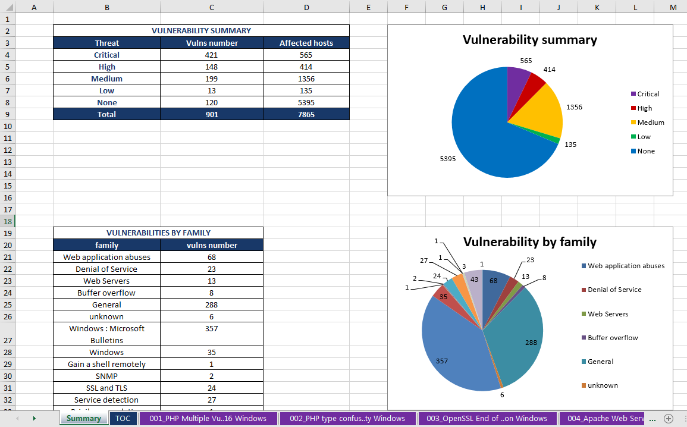
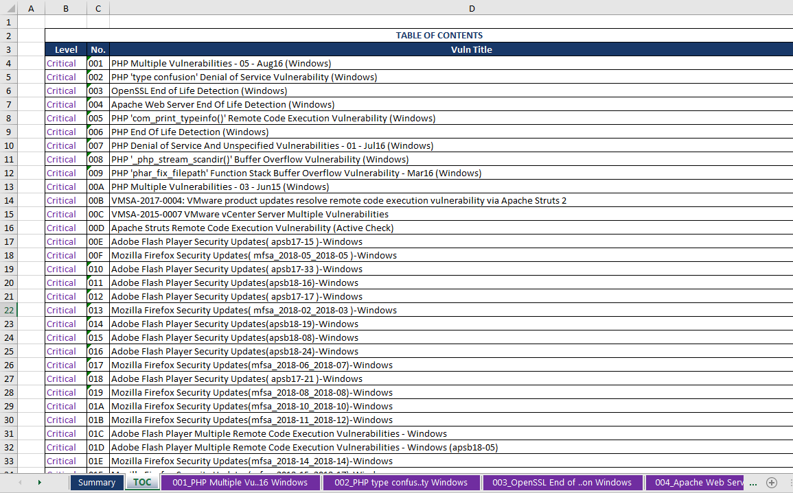
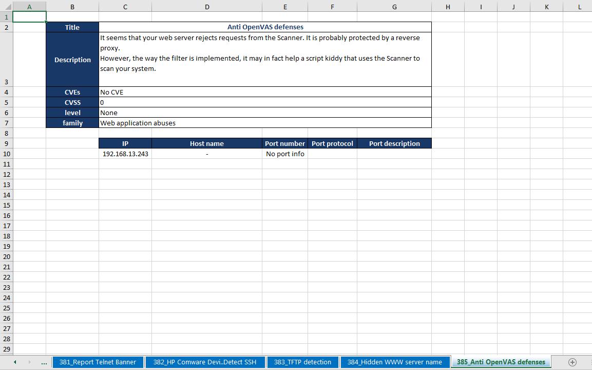

OpenVAS Reporting
================

A tool to convert OpenVAS XML into reports.

**Current stable version:** 1.0.0

Table of contents
-----------------

.. toctree::
   :maxdepth: 3

   Welcome <self>
   changelog
   usage/index

What's OpenVAS Reporting?
-------------------------

OpenVAS reporting allows you to create a report from one or more OpenVAS/Greenbone XML reports.
This way, it's easy to create simple graphs for the compliance department, create pivot tables to collect statistics,
or combine multiple scan reports into one.

The tool currently only supports exports to Excel, creating a workbook containing a summary sheet, table of contents
and a worksheet per vulnerability (with info and list of hosts).

Why create this tool?
---------------------

OpenVAS is an awesome tool for many people and it's UI is nice but not always intuitive. It currently also lacks the
ability to merge multiple task reports into one, especially when testing multiple environments. This tool allows you to
merge multiple XML reports into one.

Working with CSV exports of the OpenVAS reports is just a pain, since they include newlines which cause Excel (or other
importers) to view those lines as new inputs. This can be fixed with some find/replace voodoo, which can probably be
automated as well (in tools like Notepad++), but it's just too much hassle to filter out all edge cases.

Or maybe you just prefer working in Excel because you're used to it
(Excel is probably the #1 IT tool across all branches).

Aren't there other tools to achieve this?
-----------------------------------------

As a good netizen, I used some search engine terms to find tools that would fit my needs (merge reports, export to Excel,
perhaps export to other formats) and found cr0hn's `OpenVAS2Report <https://github.com/cr0hn/openvas_to_report>`_.
However, it appears that either the format of the XML reports has changed and the code doesn't handle this well, or my
reports contain some weird voodoo, because some of my reports would convert (partially) while others wouldn't.

It was first thinking of tracking down the error and sending a pull request to fix it. However, at the time I needed a
quick solution and I had no idea where to start tracing the error. So I made a fork of the project, but basically
rewrote chunks of the code (copy/pasting) a lot of it as well.

How can I help?
---------------

I am planning to maintain this tool in the future as to be able to support future changes to the OpenVAS report format.
I also plan on adding more functionality as I feel the need for it, or receive requests from others.

If you feel like I'd need to implement a new feature, rewrite some code, fix a bug, ...
hit me up on `Twitter <https://twitter.com/DezeStijn>`_
or file an issue on `GitHub <https://github.com/TheGroundZero/openvas_to_report>`_.

TODO list
---------

.. todolist::
