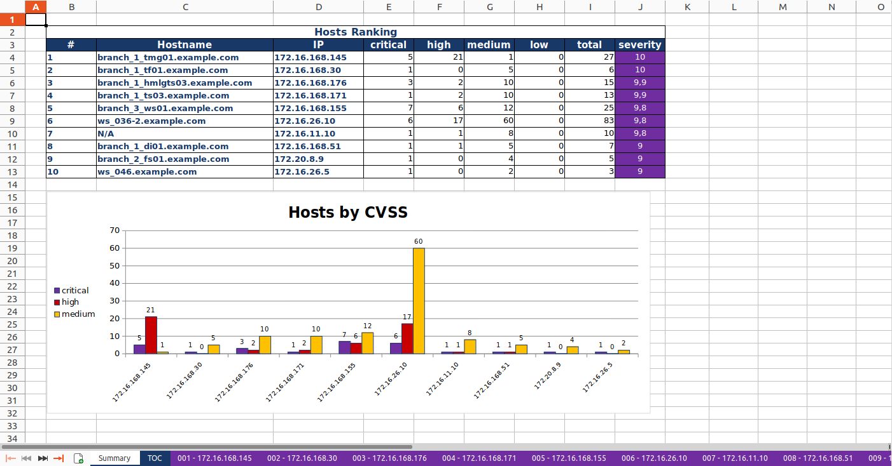
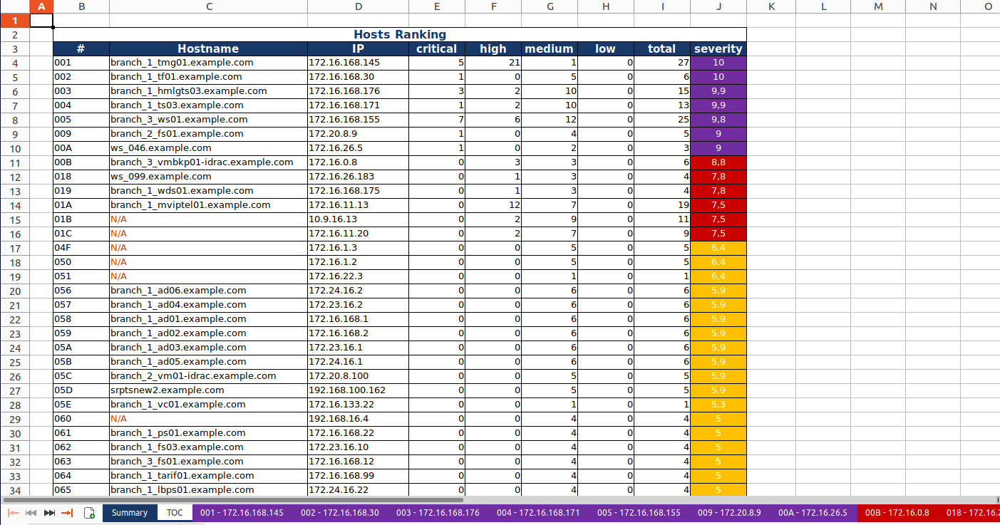
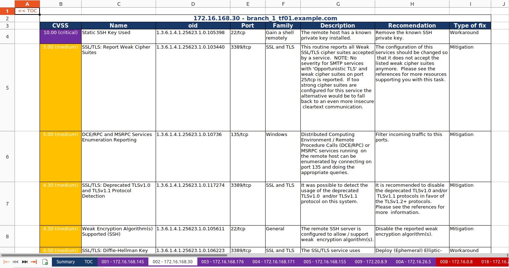

Export to Excel by Host
-----------------------

By default (or when passing the --format xlsx parameter), the tool will export reports in Excel (xlsx) format sorted by vulnerability. If you add [--report-type host] parameter, it will generate a report sorted by Host.

This report contains a summary sheet, table of contents, and a sheet per Host containing vulnerability details.

Examples
^^^^^^^^

Create Excel report from 1 OpenVAS XML report, sorted by host, using default settings 
"""""""""""""""""""""""""""""""""""""""""""""""""""""""""""""""""""""""""""""""""""""

.. code-block:: bash

   openvasreporting -i openvasreport.xml -T host

Create Excel report from multiple OpenVAS XML report, sorted by host, using default settings
""""""""""""""""""""""""""""""""""""""""""""""""""""""""""""""""""""""""""""""""""""""""""""

.. code-block:: bash

   openvasreporting -i *.xml -T host
   # OR
   openvasreporting -i openvasreport.xml -i openvasreport1.xml -i openvasreport2.xml [-i ...] -T HOST

Create Excel report from 1 OpenVAS XML report, sorted by host, reporting only severity level high and up
""""""""""""""""""""""""""""""""""""""""""""""""""""""""""""""""""""""""""""""""""""""""""""""""""""""""

.. code-block:: bash

   openvasreporting -i openvasreport.xml -o openvas_report -f xlsx -l h -T  HOST

Result
^^^^^^

The final report will look similar to this:

Vulnerability detail worksheets are sorted according to CVSS score and are colored according to the threat level.
