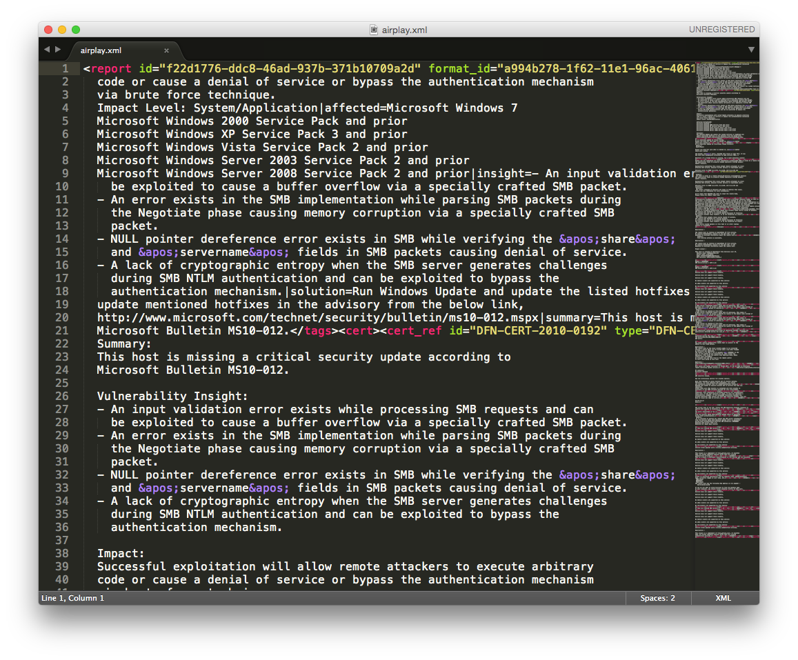
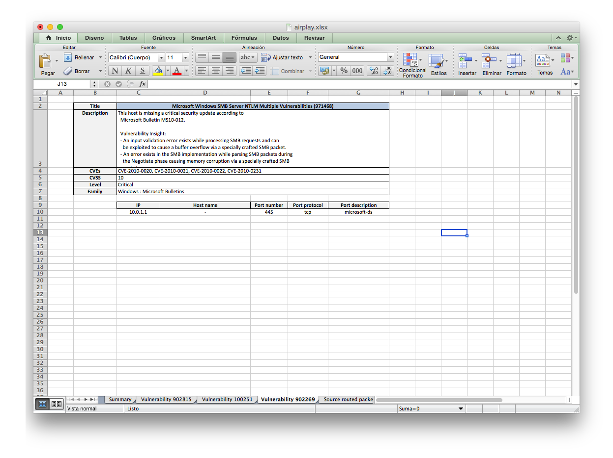

==============
OpenVAS2Report
==============

.. figure:: doc/images/logo.png
    :align: left

*OpenVAS XML report to human-friendly converter*

:Code:          https://github.com/cr0hn/openvas2report
:Issues:        https://github.com/cr0hn/openvas2report/issues
:Documentation HTML [EN]: http://openvas2report.readthedocs.org
:Version:   Python 3

What's OpenVAS2Report?
======================

The idea is very simple:

# Take an OpenVAS report, in it horrible XML formart.
# Convert it into an beautiful Excel, ready to give to your boss.

Why?
====

I'm security auditor and I really hate to pass OpenVAS XML report into to and Excel document. This is a work for a monkey, not for a human! (Yes: security auditors are humans too. I know, I know. It's incredible)

So I started to develop this project and I thought share it for help other auditors that also hate make a monkey's work.

OpenVAS to in two words
=======================

.. figure:: doc/images/excel1.png

Future
======

I'm have not enough time, but in a future, I'll write the module to export the results in a Word.

Bugs and errors
===============

If you find some bugs, please, open a ticket using github issues. And, If you send me a patch I'll be very happy :)

And if you want to help me... A beer may be a great idea :)

